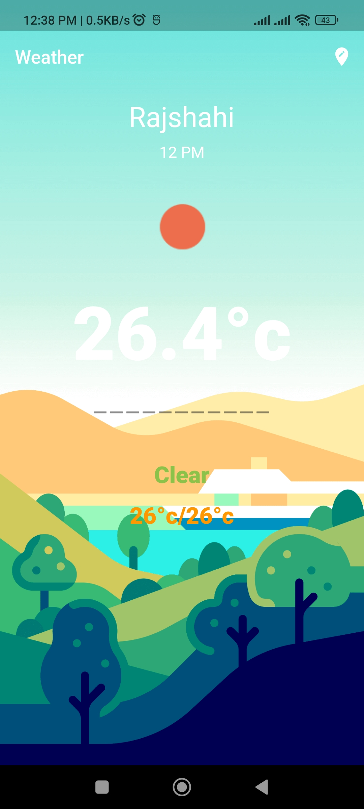
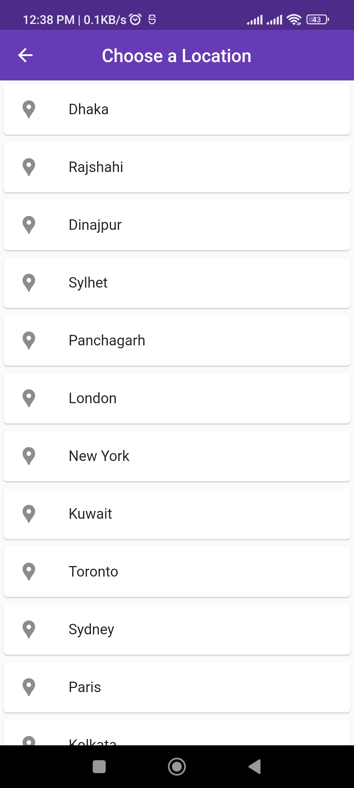
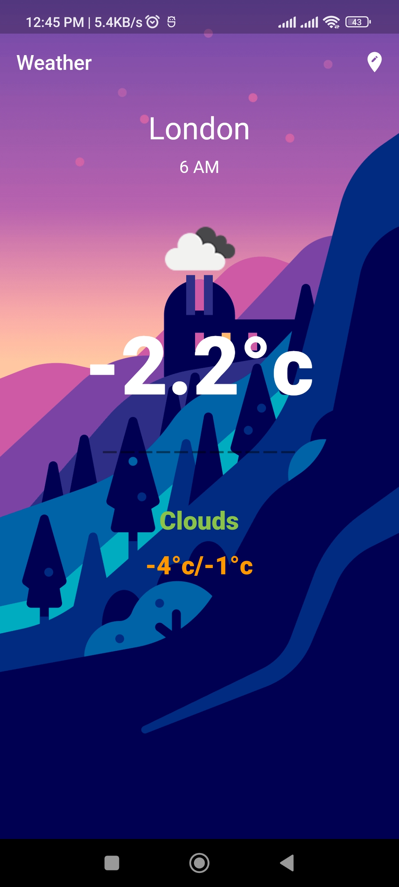

<h1 align="center">Android App Development</h1>

Final Weather App `Release Ready`

## Course Details
- Course Name: Software Development Lab III
- Course Code: CSE-3162
- Teacher: [MD. OMAR FARUQE](https://github.com/omarfaruqe)

## Built With
- [Android Studio](https://developer.android.com/studio)
- [Kotlin](https://developer.android.com/kotlin)
- [Flutter](https://flutter.dev/)

## Preview

  
  
  

