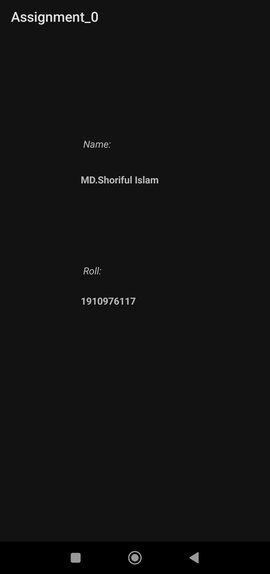

<h1 align="center">Android App Development</h1>

This Project is all about learning Android App Development so that i and my class-mates can be `কোটি-পতি পোলা` 😄.  In this Branch (Assignment_0) i amde a simple Android App, where my name and my roll no is shown.

## Course Details
- Course Name: Software Development Lab III
- Course Code: CSE-3162
- Teacher: [MD. OMAR FARUQE](https://github.com/omarfaruqe)

## Built With

- [Android Studio](https://developer.android.com/studio)
- [Kotlin](https://developer.android.com/kotlin)

## Demonstration

### Show your support

Give a ⭐ if you like this PROJECT...🙂...!

If you are interested in this project and want to modify as your wish Or, you have an optimized version of this project  
then That will be great to merge up your new Features.
**PLEASE FEEL FREE TO CONTRIBUTE ON THIS PROJECT**

<h1 align="center" style="color: green">Thanks</h1>